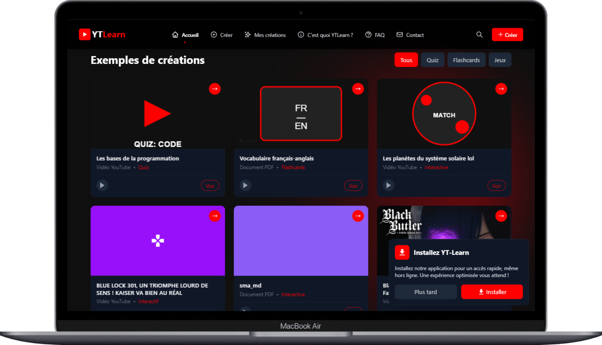
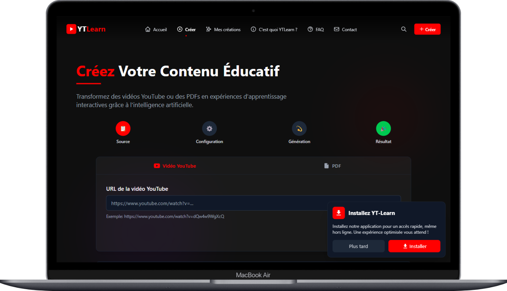

# YT-Learn

<div align="center">
  
  <p><em>Page d'accueil de YT-Learn</em></p>
</div>


## 📚 Sommaire

- [Introduction](#-introduction)
- [Fonctionnalités](#-fonctionnalités)
- [Démonstration](#-démonstration)
- [Technologies utilisées](#-technologies-utilisées)
- [Installation](#-installation)
- [Structure du projet](#-structure-du-projet)
- [Utilisation](#-utilisation)
- [API et services](#-api-et-services)
- [PWA (Progressive Web App)](#-pwa-progressive-web-app)
- [Contribution](#-contribution)
- [À propos de l'auteur](#-à-propos-de-lauteur)
- [Licence](#-licence)
- [Contact](#-contact)

## 📝 Introduction

YT-Learn est une application web innovante qui utilise l'intelligence artificielle pour transformer des vidéos YouTube et des documents PDF en expériences d'apprentissage interactives. Cette plateforme permet aux utilisateurs de créer facilement des quiz, des flashcards et des jeux éducatifs basés sur le contenu qu'ils étudient, rendant ainsi l'apprentissage plus engageant et efficace.

L'application analyse automatiquement le contenu des vidéos ou des documents, en extrait les concepts clés, et génère des activités éducatives personnalisées qui favorisent une meilleure rétention des informations et une compréhension plus profonde des sujets.

> **Notre mission :** Démocratiser l'accès à l'apprentissage actif en permettant à chacun de transformer facilement du contenu passif en outils d'apprentissage engageants.

## ✨ Fonctionnalités

### Principales fonctionnalités

- **Transformation de contenu** : Convertissez des vidéos YouTube et des documents PDF en matériel éducatif interactif
- **Création de quiz** : Générez automatiquement des quiz personnalisés basés sur le contenu analysé
- **Flashcards interactives** : Transformez les concepts clés en flashcards pour un apprentissage par répétition espacée
- **Jeux éducatifs** : Apprenez en jouant grâce aux jeux générés à partir du contenu
- **Espace personnel** : Gérez vos créations dans un espace dédié
- **Téléchargement HTML** : Exportez vos jeux au format HTML pour une utilisation hors ligne
- **Design responsive** : Interface optimisée pour tous les appareils (mobile, tablette, desktop)
- **Mode hors ligne** : Utilisez l'application même sans connexion Internet (PWA)

### Types de jeux disponibles

- **Quiz à choix multiples** : Testez vos connaissances avec des questions générées par l'IA
- **Flashcards** : Mémorisez des concepts grâce à des cartes interactives recto-verso
- **Jeux interactifs** : Engagez-vous dans des activités ludiques basées sur le contenu

## 📸 Démonstration

### Page d'accueil
<div align="center">
  
  <p><em>La page d'accueil présente l'interface principale pour commencer à créer du contenu éducatif</em></p>
</div>

### Exemples de créations
<div align="center">
  
  <p><em>Découvrez des exemples de contenus éducatifs créés avec YT-Learn</em></p>
</div>

### Interface de création
<div align="center">
  
  <p><em>Interface intuitive pour créer du contenu éducatif à partir de vidéos YouTube ou de documents PDF</em></p>
</div>

## 🛠 Technologies utilisées

### Frontend
- **React 18** : Librairie JavaScript pour construire l'interface utilisateur
- **TypeScript** : Typage statique pour un code plus robuste
- **Tailwind CSS** : Framework CSS pour un design moderne et responsive
- **Framer Motion** : Animations fluides et transitions élégantes
- **React Router** : Navigation entre les différentes pages de l'application


### Outils et bibliothèques supplémentaires
- **Vite** : Bundler et serveur de développement ultra-rapide
- **ESLint** & **Prettier** : Maintien de la qualité et de la cohérence du code
- **Jest** & **React Testing Library** : Tests unitaires et d'intégration
- **Workbox** : Gestion du cache et des fonctionnalités PWA

## 🚀 Installation

Pour installer et exécuter YT-Learn localement, suivez ces étapes:

```bash
# Cloner le dépôt
git clone https://github.com/Tiger-Foxx/yt-learn.git

# Accéder au répertoire
cd yt-learn

# Installer les dépendances
npm install

# Créer un fichier .env à partir du modèle
cp .env.example .env
# Remplissez les variables d'environnement nécessaires

# Lancer le serveur de développement
npm run dev

# Pour construire la version de production
npm run build
```

### Prérequis
- Node.js 16+ et npm
- Un compte Firebase (pour les fonctionnalités backend)
- Une clé API OpenAI (pour la génération de contenu IA)

## 📁 Structure du projet

```
yt-learn/
├── public/                   # Fichiers statiques
│   ├── favicon.png           # Favicon de l'application
│   ├── manifest.json         # Configuration PWA
│   ├── offline.html          # Page hors ligne pour PWA
│   └── screenshots/          # Captures d'écran pour le README
│
├── src/                      # Code source
│   ├── assets/               # Images, fonts, etc.
│   ├── components/           # Composants React réutilisables
│   │   ├── layout/           # Composants de mise en page (Header, Footer)
│   │   ├── ui/               # Composants d'interface utilisateur
│   │   └── pwa/              # Composants liés à la PWA
│   │
│   ├── config/               # Fichiers de configuration
│   ├── context/              # Contextes React (état global)
│   ├── hooks/                # Hooks personnalisés
│   ├── pages/                # Composants de page
│   │   ├── HomePage.tsx
│   │   ├── CreationPage.tsx
│   │   ├── PlaySpacePage.tsx
│   │   ├── GamePage.tsx
│   │   ├── ContactPage.tsx
│   │   ├── AboutPage.tsx
│   │   ├── FAQPage.tsx
│   │   ├── PrivacyPolicyPage.tsx
│   │   └── NotFoundPage.tsx
│   │
│   ├── services/             # Services (API, Firebase, etc.)
│   ├── styles/               # Styles globaux
│   ├── types/                # Définitions de types TypeScript
│   ├── utils/                # Fonctions utilitaires
│   ├── App.tsx               # Composant racine
│   └── main.tsx              # Point d'entrée
│
├── .env.example              # Modèle de variables d'environnement
├── .eslintrc.js              # Configuration ESLint
├── .gitignore                # Fichiers ignorés par Git
├── index.html                # Page HTML principale
├── package.json              # Dépendances et scripts
├── postcss.config.js         # Configuration PostCSS
├── tailwind.config.js        # Configuration Tailwind CSS
├── tsconfig.json             # Configuration TypeScript
├── vite.config.ts            # Configuration Vite
└── README.md                 # Ce fichier
```

## 🔍 Utilisation

### Créer du contenu éducatif à partir d'une vidéo YouTube

1. Sur la page d'accueil, sélectionnez l'onglet "Vidéo YouTube"
2. Collez l'URL de la vidéo YouTube que vous souhaitez transformer
3. Cliquez sur "Créer avec YouTube"
4. Choisissez le type de contenu éducatif que vous voulez créer (Quiz, Flashcards, etc.)
5. Personnalisez les options si nécessaire
6. Attendez que l'IA analyse le contenu et génère votre matériel éducatif
7. Commencez à apprendre avec votre contenu nouvellement créé!

### Créer du contenu éducatif à partir d'un document PDF

1. Sur la page d'accueil, sélectionnez l'onglet "Document PDF"
2. Cliquez sur "Créer avec PDF"
3. Téléchargez votre document PDF
4. Choisissez le type de contenu éducatif que vous voulez créer
5. Personnalisez les options si nécessaire
6. Attendez que l'IA analyse le contenu et génère votre matériel éducatif
7. Commencez à apprendre avec votre contenu nouvellement créé!

### Gérer vos créations

1. Accédez à "Mes Espaces" depuis le menu principal
2. Parcourez toutes vos créations précédentes
3. Filtrez par type de contenu ou source (YouTube/PDF)
4. Cliquez sur une création pour la revoir ou y jouer
5. Utilisez le bouton "Télécharger HTML" pour exporter un jeu et l'utiliser hors ligne
6. Supprimez les contenus que vous ne souhaitez plus conserver

## 🌐 API et services

YT-Learn s'appuie sur plusieurs API et services externes:

### YouTube Data API
Utilisée pour extraire les métadonnées et les sous-titres des vidéos YouTube, qui sont ensuite analysés pour générer du contenu éducatif.

### OpenAI API
Traite le contenu extrait pour identifier les concepts clés et générer différents types de contenus éducatifs comme des questions de quiz, des flashcards ou des jeux interactifs.

### Firebase
- **Authentication** : Gestion de l'authentification des utilisateurs
- **Firestore** : Stockage des données des utilisateurs et des créations
- **Storage** : Stockage des fichiers PDF téléchargés
- **Hosting** : Hébergement de l'application web

## 📱 PWA (Progressive Web App)

YT-Learn est une Progressive Web App complète, ce qui signifie qu'elle peut être installée sur votre appareil mobile ou votre ordinateur comme une application native.

### Caractéristiques PWA
- **Installation sur l'écran d'accueil** : Ajoutez l'application à votre écran d'accueil pour un accès rapide
- **Fonctionnement hors ligne** : Utilisez l'application même sans connexion Internet
- **Mises à jour automatiques** : Recevez les dernières fonctionnalités sans action manuelle
- **Chargement rapide** : Expérience utilisateur fluide grâce au cache intelligent

### Comment installer YT-Learn

#### Sur Android
1. Visitez [YT-Learn](https://yt-learn.web.app) dans Chrome
2. Appuyez sur "Ajouter à l'écran d'accueil" ou "Installer l'application" lorsque vous y êtes invité
3. L'application est maintenant installée et accessible depuis votre écran d'accueil

#### Sur iOS
1. Visitez [YT-Learn](https://yt-learn.web.app) dans Safari
2. Appuyez sur le bouton de partage
3. Faites défiler et appuyez sur "Sur l'écran d'accueil"
4. Confirmez en appuyant sur "Ajouter"
5. L'application est maintenant installée sur votre écran d'accueil

#### Sur Desktop (Windows, macOS, Linux)
1. Visitez [YT-Learn](https://yt-learn.web.app) dans Chrome, Edge ou un autre navigateur compatible
2. Cliquez sur l'icône d'installation dans la barre d'adresse (généralement sur la droite)
3. Suivez les instructions pour installer l'application

## 👥 Contribution

Les contributions à YT-Learn sont les bienvenues ! Voici comment vous pouvez participer:

1. Forkez le dépôt
2. Créez une nouvelle branche (`git checkout -b feature/amazing-feature`)
3. Effectuez vos modifications
4. Committez vos changements (`git commit -m 'Add some amazing feature'`)
5. Poussez vers la branche (`git push origin feature/amazing-feature`)
6. Ouvrez une Pull Request

### Directives de contribution
- Suivez les conventions de code existantes
- Ajoutez des tests pour les nouvelles fonctionnalités
- Mettez à jour la documentation si nécessaire
- Assurez-vous que tous les tests passent avant de soumettre

## 👤 À propos de l'auteur

<div align="center">
  
  <h3>Pascal Arthur Donfack</h3>
  <p>Développeur Full Stack & Spécialiste IA</p>
</div>

Pascal Arthur Donfack est un développeur passionné par l'application de l'intelligence artificielle dans le domaine de l'éducation. Avec YT-Learn, il souhaite rendre l'apprentissage plus accessible et engageant grâce à des outils innovants basés sur l'IA.

- **Site Web**: [the-fox.tech](https://the-fox.tech/)
- **LinkedIn**: [Pascal Arthur Donfack](https://www.linkedin.com/in/pascal-arthur-donfack-567575327/)
- **GitHub**: [@Tiger-Foxx](https://github.com/Tiger-Foxx/)
- **Instagram**: [@i_am_the_fox_coder](https://www.instagram.com/i_am_the_fox_coder/)

## 📄 Licence

Ce projet est sous licence MIT - voir le fichier [LICENSE](LICENSE) pour plus de détails.

## 📞 Contact

Pour toute question, suggestion ou collaboration, n'hésitez pas à me contacter:

- **Email**: [donfackarthur750@gmail.com](mailto:donfackarthur750@gmail.com)
- **WhatsApp**: [+237 658 866 639](https://wa.me/+237658866639)
- **Site Web**: [the-fox.tech](https://the-fox.tech/contact)

---

<p align="center">
  <a href="https://yt-learn.web.app">
    
  </a>
  <br>
  <em>YT-Learn - Intelligence artificielle de pointe au service de l'éducation</em>
  <br>
  <a href="https://github.com/Tiger-Foxx/yt-learn">GitHub</a> |
  <a href="https://yt-learn.vercel.app">Demo</a> |
  <a href="https://the-fox.tech">Site de l'auteur</a>
</p>